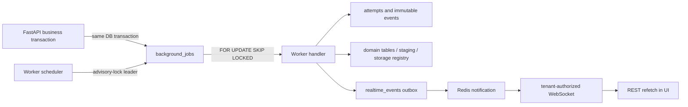

# Background jobs, imports, MinIO registry, and retention

Stage 14 extends the existing Worker instead of introducing another queue or
another process. PostgreSQL is the durable source of truth for jobs, schedules,
attempts, storage metadata, and retention decisions. Redis is used for realtime
notifications and a scheduler health hint; losing Redis does not remove a job or
release the PostgreSQL scheduler lock.

## Runtime architecture



The Worker registers handlers for Knowledge ingestion, background customer
imports, realtime-outbox cleanup, stale-lease recovery, MinIO consistency,
retention eligibility and purge, expired previews and temporary objects, and
dead-letter monitoring. Domain handlers receive only a tenant-scoped job claim
and a bounded safe payload.

## Delivery and concurrency guarantees

- Execution is **at least once**. Exactly-once execution is not claimed.
- Enqueue is transactional when it is part of a database business operation. A
  rolled-back business transaction does not leave a runnable job.
- `(tenant_id, type, idempotency_key)` prevents duplicate enqueue. Administrative
  commands additionally use `job_command_submissions` so a repeated cancel or
  retry returns the previously accepted result.
- Workers claim one row with `FOR UPDATE SKIP LOCKED`, issue a unique lease token,
  and create a numbered `background_job_attempts` row.
- The lease heartbeat extends `lease_expires_at`. A process crash leaves the lease
  intact; stale-job recovery moves it to `retry_wait` or `dead_letter` after the
  lease expires.
- Retry delay is capped exponential backoff with deterministic per-job jitter:
  `min(max_delay, base_delay * 2^(attempt-1))`, multiplied by the configured
  jitter factor.
- Tenant concurrency and per-job-type concurrency are applied while claiming.
  Tenants are visited round-robin. Effective priority increases with age up to a
  configured cap so low-priority work cannot starve forever.
- Cancellation is cooperative for a running handler. A handler checks the lease
  and cancellation flag between bounded units of work. Atomic finalization is not
  interrupted once it starts.
- On graceful shutdown no new work is claimed, active handlers receive a bounded
  shutdown window, and unfinished work is recovered through its durable lease.

Canonical job states are `pending`, `scheduled`, `running`, `retry_wait`,
`completed`, `failed`, `dead_letter`, `cancel_requested`, and `cancelled`.
`failed` means a non-retryable handler error; exhausted retryable failures enter
`dead_letter`. Raw exceptions, customer rows, document content, credentials, and
tokens are not stored in `safe_payload`, events, or ordinary logs.

## Scheduler

Every Worker instance may execute jobs, but only the instance holding the
PostgreSQL advisory lock identified by `SCHEDULER_ADVISORY_KEY` enqueues recurring
work. `scheduled_jobs.next_run_at` is UTC and durable. Each occurrence has a key
derived from the schedule and its intended UTC timestamp, so restart/missed-run
recovery cannot enqueue the same occurrence twice.

Default maintenance schedules cover:

- stale job recovery;
- expired synchronous/background import preview cleanup;
- realtime outbox retention;
- MinIO orphan and consistency scans;
- retention eligibility scans;
- second-phase retention purge;
- expired temporary-object cleanup;
- dead-letter monitoring.

The Redis scheduler heartbeat is observability only. PostgreSQL advisory-lock
ownership and `scheduled_jobs` remain authoritative.

## Knowledge ingestion compatibility

`DocumentIngestionJob` remains the domain lifecycle record required by immutable
Knowledge revisions and citations. It is linked to one `BackgroundJob`; the common
queue owns claiming, attempts, retry, cancellation, and crash recovery, while the
existing Knowledge handler still performs extraction, chunking, pgvector indexing,
and lifecycle transitions. This avoids two consumers racing for one document.
Existing ingestion records are preserved by the Stage 14 migration and historical
citations are not retention candidates.

## Background customer import

The synchronous two-step import remains available for files up to 2 MiB and 500
rows. The background path accepts configured CSV/XLSX limits (25 MiB and 100,000
rows by default), validates the source in the API, stores it under a server-generated
private MinIO key, and enqueues preview work.

The commit flow is deliberately staged:

1. Preview downloads and validates the private source without changing customers.
2. Mapping, sheet, and explicit `skip`/`update` policy are frozen as snapshots.
3. The Worker streams rows and writes normalized tenant/project-scoped staging rows.
4. Invalid rows and preliminary duplicate decisions are recorded in staging.
5. Customer inserts/updates run inside one PostgreSQL finalization transaction under
   a project/import advisory lock.
6. Every row uses a savepoint, so a concurrent phone/e-mail/external-ID claim rolls
   back both its scalar fields and contacts and is recorded as a runtime duplicate.
7. After finalization, a private error report is generated from the final staging
   decisions; only then does the common job finish and publish its terminal event.
8. A later maintenance operation may remove staging and expired temporary objects.

A crash or cancellation before finalization leaves the customer tables unchanged.
Retry uses the same import/job identifiers and staging uniqueness, so it does not
create duplicate customers. Failed imports, including a completed merge whose report
upload exhausted retries, use the domain `/retry` command; a retention-purged payload
is explicitly non-retryable. Cancellation is rejected during atomic finalization.
Error reports are private MinIO objects; the download endpoint performs tenant and
project authorization before returning a short-lived signed URL.

## MinIO object registry and consistency

`storage_objects` records every controlled object using a server-generated key,
tenant/project scope, category, owner aggregate, SHA-256 checksum, size, MIME type,
expiry, lifecycle timestamps, legal-hold flag, and optimistic `lock_version`.
Supported categories are:

- `knowledge_original`;
- `import_source`;
- `import_report`;
- `temporary_preview`;
- `call_recording`;
- `generated_report`;
- `other`.

The bucket remains private. The browser cannot provide an arbitrary object key.
Consistency scanning compares tenant-scoped registry entries with controlled MinIO
prefixes and records `missing_object`, `orphan_object`, `checksum_mismatch`,
`size_mismatch`, `incomplete_multipart`, or `expired_temporary` issues.

An orphan is never deleted on first sight. The implemented lifecycle is detection
(`open`), a configured grace period, and repeat confirmation (`confirmed`). A
confirmed orphan remains quarantined for explicit administrator reconciliation;
Stage 14 deliberately does not auto-delete an unregistered MinIO key. A later
successful verification resolves prior missing or checksum/size issues. Registry
rows are visited with a durable keyset order and MinIO prefixes are streamed in
bounded pages; `STORAGE_SCAN_MAX_OBJECTS` controls page size, not total coverage.

## Retention and two-stage purge

Automatic irreversible purge is disabled by default. A tenant must explicitly enable
the reviewed policy. Durations are independently configurable for call recordings,
transcripts, temporary import files, import reports, archived Knowledge originals,
realtime events, completed jobs, and failed/dead-letter jobs. A `null` duration means
that category is not automatically purged.

Retention has two phases:

1. An administrator preview materializes an exact candidate set and binds it to the
   preview ID. A confirmed run can promote only that reviewed set to `pending_purge`;
   newly eligible data is never added behind the preview. Scheduled dry scans may
   create reversible `eligible` candidates for a later preview. For temporary objects,
   both the policy age and an explicit operational expiry (when present) must pass.
2. After the grace period, the purge handler re-locks the candidate and rechecks the
   tenant, unchanged enabled policy/version, age, status, active references, active
   call protection, current draft/published Knowledge references, and legal holds.
   Policy/hold/reference mutations and the bounded MinIO delete are serialized by the
   same tenant advisory lock. Only then may metadata transition to `purged`.

An administrator can cancel `eligible` or `pending_purge` before deletion. If MinIO
already reports the object absent, the operation remains idempotent. If MinIO deletion
succeeds before the metadata transaction commits, a retry sees the missing object and
finishes the same metadata transition. The Call, historical outcome, aggregate usage,
and audit trail are not deleted when a recording object is purged.

Audit logs, active documents, published Knowledge revisions, historical citations,
legal-held data, active calls, and unfinished jobs are never automatic purge targets.
Recording retention is implemented and tested with Mock/test objects only; live SIP
recording retention remains unverified.

## Legal hold

Legal holds may target a tenant, project, call, customer, or document. Scope IDs are
resolved by the backend inside the authenticated tenant and accessible project. One
active hold per scope is enforced. Creating or releasing a hold requires the retention
management permission and an optimistic version check on release.

A hold blocks both eligibility and the final purge recheck. The action, actor, reason,
timestamp, and release are audited. Operator and analyst roles cannot change holds.

## API and RBAC boundary

Administrative routes are under `/api/v1`:

- `/background-jobs`, `/{id}`, `/{id}/attempts`, `/{id}/events`, `/stats`,
  `/dead-letter`, `/{id}/cancel`, and `/{id}/retry`;
- `/customers/import/background/*` for preview, status, atomic commit, cancellation,
  domain retry, and report download;
- `/storage/summary`, `/storage/issues`, and `/storage/scan`;
- `/retention/policy`, `/retention/preview`, `/retention/run`,
  `/retention/candidates`, and candidate cancellation;
- `/legal-holds` and `/{id}/release`.

Owners manage jobs, storage, retention, and holds. Managers manage accessible-project
operations according to their existing permissions. Analysts receive read-only safe
summaries. Operators can see only their own eligible jobs/imports and cannot manage
retention. API responses expose summaries rather than raw payloads when a payload may
identify customers.

Every new tenant table has tenant-aware foreign keys and indexes, scoped uniqueness,
and PostgreSQL `ENABLE ROW LEVEL SECURITY` plus `FORCE ROW LEVEL SECURITY`. Requested
tenant, membership, or project identifiers are always intersected with the authenticated
principal; the UI is not the authorization boundary.

## Realtime and observability

Job/import/storage/retention changes enqueue the existing Stage 12 durable outbox
events: `job.started`, `job.progress`, `job.completed`, `job.failed`, `job.cancelled`,
`import.progress`, `import.completed`, `retention.preview_ready`,
`retention.run_completed`, and `storage.issue_detected`. Payloads contain identifiers,
status, progress, and safe counters only. The frontend performs a tenant-authorized
REST refetch and falls back to bounded polling while WebSocket is offline.

Worker health/readiness reports PostgreSQL, Redis, MinIO, realtime publisher, common
job runner, and scheduler separately. A MinIO or Redis failure does not make the REST
API itself unavailable when PostgreSQL remains healthy. Tenant-authorized operational
endpoints expose queue depth, oldest pending time, attempt durations and retries,
dead-letter counts, scheduler state, storage bytes by category, consistency issues,
pending purge, and import row counters. Full Prometheus aggregation and alerting remain
part of the production deployment stage. Logs contain IDs and safe error codes, not
source rows, transcripts, document bodies, tokens, or credentials.

## Configuration names

The following names are configurable; secret values must be supplied through the
existing secret mechanism and never committed:

- `BACKGROUND_JOB_WORKERS`, `BACKGROUND_JOB_POLL_SECONDS`;
- `BACKGROUND_JOB_LEASE_SECONDS`, `BACKGROUND_JOB_HEARTBEAT_SECONDS`;
- `BACKGROUND_JOB_HANDLER_TIMEOUT_SECONDS`,
  `BACKGROUND_JOB_SHUTDOWN_TIMEOUT_SECONDS`;
- `BACKGROUND_JOB_TENANT_CONCURRENCY`,
  `BACKGROUND_JOB_DEFAULT_TYPE_CONCURRENCY`;
- `BACKGROUND_JOB_PRIORITY_AGING_SECONDS`, `BACKGROUND_JOB_PRIORITY_AGE_CAP`;
- `BACKGROUND_JOB_RETRY_BASE_SECONDS`, `BACKGROUND_JOB_RETRY_MAX_SECONDS`,
  `BACKGROUND_JOB_RETRY_JITTER_RATIO`;
- `SCHEDULER_POLL_SECONDS`, `SCHEDULER_ADVISORY_KEY`;
- `CUSTOMER_IMPORT_MAX_FILE_BYTES`, `CUSTOMER_IMPORT_MAX_ROWS`,
  `CUSTOMER_IMPORT_MAX_COLUMNS`, `CUSTOMER_IMPORT_MAX_SHEETS`,
  `CUSTOMER_IMPORT_BATCH_ROWS`;
- `STORAGE_SCAN_MAX_OBJECTS`, `STORAGE_CONSISTENCY_GRACE_DAYS`;
- `RETENTION_SCAN_BATCH_SIZE`, `RETENTION_PURGE_BATCH_SIZE`;
- `MINIO_ENDPOINT`, `MINIO_BUCKET`, `MINIO_ROOT_USER`,
  `MINIO_ROOT_PASSWORD`.

## Verification and operational limits

Run the Stage 14 migration preservation check only against its isolated local test
database:

```powershell
py -3.12 scripts/run_background_migration_test.py
```

The normal API, Worker, Web, Gateway, and Playwright runners remain fail-closed against
non-test databases. The E2E runner starts API, Web, and Worker as runner-owned processes,
then removes its isolated database in `finally`.

Stage 14 does not verify live SIP recordings, OpenAI embeddings, OCR, production
antivirus, CRM integrations, billing, or deployment. In particular:

- `BLOCKED — LIVE EMBEDDING VERIFICATION REQUIRED` remains from Stage 13;
- `BLOCKED — LIVE RECORDING RETENTION VERIFICATION REQUIRED` remains until a real
  SIP call produces and expires a recording under the reviewed policy.
