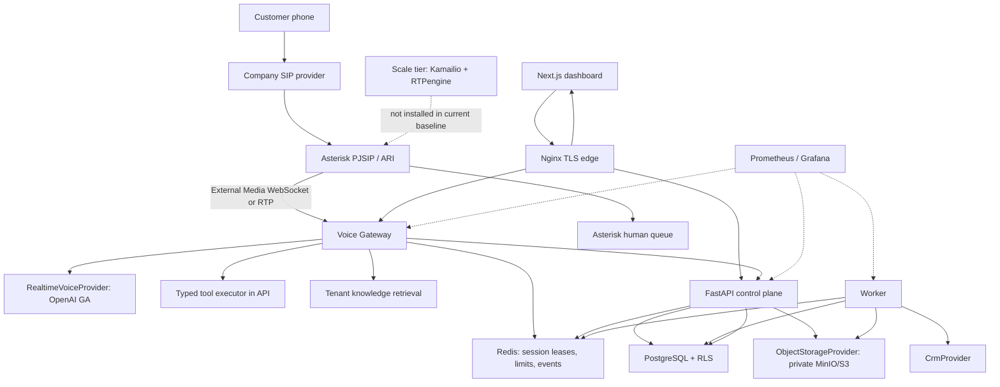
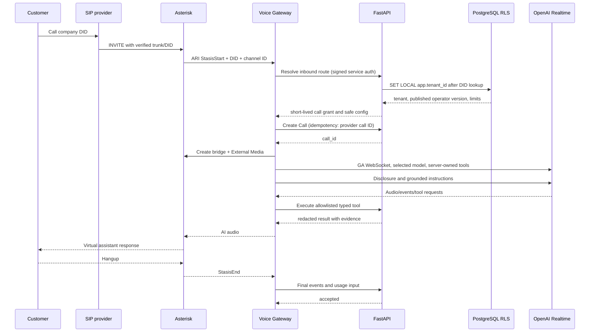
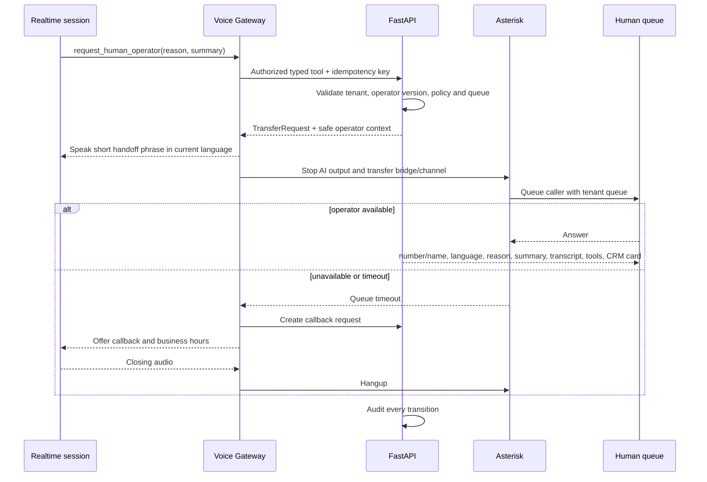
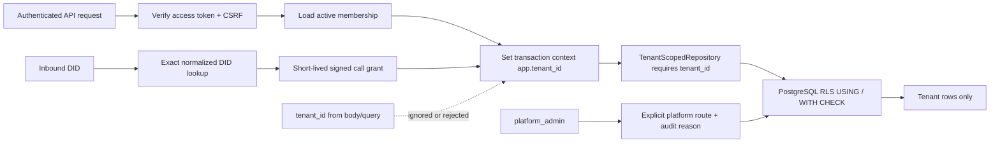
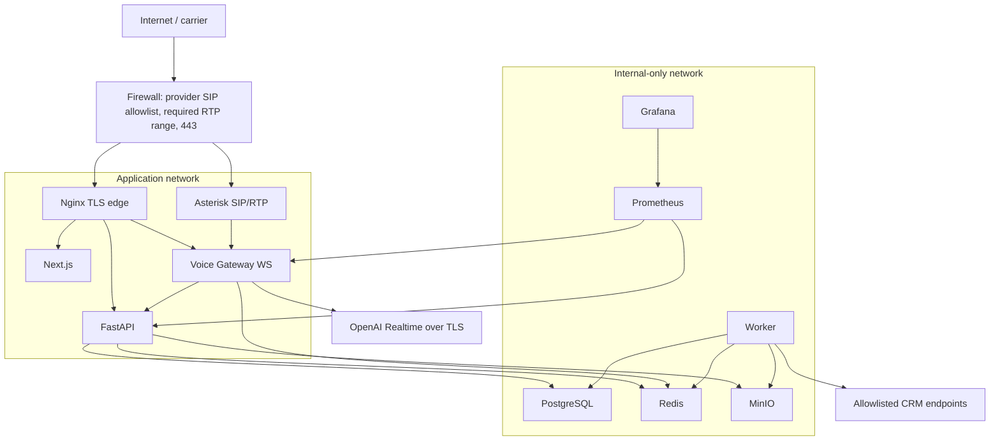
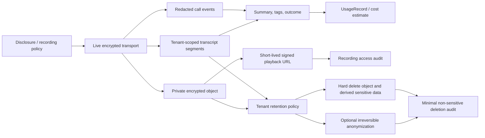

# Teamora Voice architecture

## Scope and status vocabulary

Teamora Voice is a multi-tenant SaaS control plane and realtime media plane for company-owned call-center workflows. The first supported vertical slice is a development simulation; real SIP and OpenAI calls are separate deployment gates.

Status meanings:

- **Implemented**: code and local automated tests exist.
- **Configured**: environment/config wiring exists, but no provider behavior is implied.
- **Mock verified**: deterministic mock integration tests pass.
- **Live verified**: a dated real-provider canary passed with evidence.
- **Unavailable**: adapter or UI may be described, but execution is blocked and not presented as working.

Language status is configuration data: `ru=production`, `en=production`, `uz=beta`, `kaa=experimental`. `kaa` additionally requires `KARAKALPAK_EXPERIMENTAL=true` and is never promoted without real STT/TTS tests.

## System architecture

The browser never receives provider keys or privileged tool handlers. The voice gateway owns realtime session state; the API owns identity, tenant authorization, durable business state, tool policy and audit.

## Service boundaries

| Component                | Owns                                                                 | Must not own                                        |
| ------------------------ | -------------------------------------------------------------------- | --------------------------------------------------- |
| `apps/web`               | UX, localization, safe API client, accessibility                     | secrets, tenant selection authority, provider calls |
| `services/api`           | auth, RBAC, tenant scope, domain APIs, tools, analytics, audit       | RTP timing, long realtime WebSockets                |
| `services/voice-gateway` | ARI/media sessions, Realtime adapter, VAD/barge-in, tool event relay | direct SQL, CRM credentials, arbitrary tools        |
| `services/worker`        | summaries, safe sync, retention, notifications, usage rollups        | live audio loop, unsafe write retries               |
| `packages/contracts`     | versioned schemas/events/provider contracts                          | runtime credentials                                 |
| `packages/config`        | validated non-secret configuration helpers                           | committed secrets                                   |
| `packages/ui`            | tokens and reusable accessible components                            | tenant/business logic                               |
| Asterisk                 | SIP/RTP, DID ingress, bridges, queues, CDR                           | AI policy or tenant database access                 |

## Inbound call sequence

The first utterance must disclose the virtual assistant and configurable recording. Recording cannot silently begin before applicable policy allows it.

## Human handoff

Transfer triggers include an explicit request, two failed-understanding events, unknown answer, prohibited action, critical tool error, serious complaint, duration limit or confidence below policy.

## Multi-tenant resolution

### Tenant invariants

- All tenant business tables use non-null `tenant_id`, `created_at`, and `updated_at`. Global catalogs (`Permission`, base `Plan`) are explicitly documented exceptions.
- IDs are UUIDs, but unguessability is not authorization.
- A tenant-scoped transaction executes `SET LOCAL app.tenant_id = :tenant_id`; RLS uses `current_setting('app.tenant_id', true)`.
- The application database role cannot bypass RLS and does not own protected tables in production.
- Platform operations use a separate explicit policy path, require a reason, and create an audit entry. Recording playback adds a dedicated audit action.
- Worker jobs carry a signed tenant/job envelope and open a separate scoped transaction per tenant.
- Redis keys and object paths begin with an internal tenant UUID; public input never constructs a storage key.

## Deployment

Compose is for local development and controlled single-host evaluation. Kubernetes is out of scope. A production deployment requires managed secrets, TLS certificates, private database/storage networks, backups, restore evidence, carrier allowlists and an immutable release procedure.

## Data lifecycle

Full transcripts, audio, secrets and tool payloads containing PII are prohibited in infrastructure logs. Log fields contain correlation ID, call ID, tenant ID, state, duration, error class and redacted identifiers.

## Provider interfaces

The concrete Stage 7 command/event boundary and project-aware provider selection are
documented in [telephony-layer.md](telephony-layer.md).

Provider ports live in shared contracts and are implemented behind factories:

- `RealtimeVoiceProvider`: create/update/close session, append audio, handle audio/events/tool requests and interruption.
- `SpeechToTextProvider`: transcribe test audio with explicit locale and confidence metadata.
- `TextToSpeechProvider`: synthesize Language Lab samples with explicit voice/locale.
- `TelephonyProvider`: resolve/answer/bridge/transfer/hangup and recording controls.
- `CrmProvider`: bounded typed operations only; no generic arbitrary URL method.
- `ObjectStorageProvider`: tenant prefix, encryption metadata, private put/get/delete and signed URL.
- `NotificationProvider`: tenant-scoped templates and idempotent delivery.

Initial implementations are OpenAI Realtime, Asterisk, MinIO and generic signed webhook CRM. Azure Speech, Yandex SpeechKit, Bitrix24, amoCRM and Google Sheets start in `unavailable` state and cannot be selected without both implementation capability flags and credentials.

The OpenAI adapter follows the released Realtime WebSocket path and keeps business logic server-side: [Realtime WebSocket guide](https://developers.openai.com/api/docs/guides/realtime-websocket), [server-side controls](https://developers.openai.com/api/docs/guides/realtime-server-controls), and [the requested model](https://developers.openai.com/api/docs/models/gpt-realtime-2.1-mini). It sends no removed beta header.

## Domain model groups

All tenant-owned models carry the tenant columns, even when the tenant can be inferred through a relation.

| Group            | Models                                                                                                                                         |
| ---------------- | ---------------------------------------------------------------------------------------------------------------------------------------------- |
| Identity         | Tenant, TenantSettings, User, Membership, Role, Permission, RefreshToken, Invitation                                                           |
| Telephony        | PhoneNumber, SipTrunk, SipCredentialReference, InboundRoute, OutboundRoute                                                                     |
| AI configuration | AiOperator, AiOperatorVersion, VoiceProfile, LanguageConfiguration, CallFlow, CallFlowVersion                                                  |
| Knowledge        | KnowledgeSource, KnowledgeDocument, KnowledgeChunk, KnowledgeSyncJob                                                                           |
| CRM              | Customer, CustomerContact, CustomerNote                                                                                                        |
| Conversation     | Call, CallParticipant, CallEvent, TranscriptSegment, CallSummary, CallRecording, CallTag, CallOutcome, CallResultCatalog, CallResultDefinition |
| Human operations | HumanOperator, OperatorStatus, OperatorQueue, QueueMember, TransferRequest                                                                     |
| Integrations     | Integration, IntegrationCredentialReference, CrmFieldMapping, WebhookEndpoint, WebhookDelivery                                                 |
| Tools            | ToolDefinition, ToolPermission, ToolExecution                                                                                                  |
| Billing          | UsageRecord, UsageLimit, Plan, Subscription, Invoice, Payment                                                                                  |
| Operations       | Notification, AuditLog, SystemIncident, FeatureFlag                                                                                            |

Secret reference models contain a provider/key identifier and encrypted metadata only. The local secret store uses authenticated encryption with a key supplied outside PostgreSQL; production uses a Vault/KMS adapter.

## API and trust controls

- Prefix: `/api/v1`; cursor or bounded offset pagination, allowlisted sort fields and typed filters.
- Auth: short-lived access JWT plus opaque, hashed, rotating refresh token in HttpOnly cookies. Mutations require CSRF double-submit verification and `Origin` allowlisting.
- Service calls: short-lived signed audience-specific tokens, not browser access tokens.
- Errors: stable code, message, correlation ID, optional field issues; no stack trace or tenant data.
- Webhooks: raw-body signature verification, timestamp tolerance, delivery ID deduplication, durable delivery record and safe retry rules. OpenAI webhooks use the official signature workflow and `webhook-id` deduplication.
- Rate limits: IP limits for auth plus tenant buckets for API, tool calls, uploads and concurrent calls.
- Files: content sniffing, allowlisted MIME/extensions, maximum size, quarantine state and antivirus adapter before indexing.
- Secrets: redaction at config and logging boundaries; platform UI exposes only credential state and last verification time.

## Tool execution boundary

The model sees only a per-version allowlist from the server registry. Each invocation binds `tenant_id`, `call_id`, `ai_operator_version_id`, tool definition/version, arguments hash and idempotency key before validation. Side effects require domain-level authorization and policy checks. `get_order_status` may return a safe status; it cannot alter an order. Price, discount, order mutation and payment confirmation are never generic tools.

Allowed tool names:

`search_knowledge`, `find_customer`, `create_customer`, `create_lead`, `create_support_ticket`, `get_order_status`, `book_appointment`, `reschedule_appointment`, `cancel_appointment`, `send_confirmation`, `request_human_operator`, `transfer_call`, `end_call`.

## Realtime and telephony decisions

- Gateway ↔ OpenAI uses the GA server WebSocket with `OPENAI_REALTIME_MODEL=gpt-realtime-2.1-mini` by default and standard backend API-key authentication.
- Asterisk media starts with `ulaw` at the carrier/PBX boundary. The gateway owns explicit codec conversion to the provider format and bounds jitter/buffer growth.
- Newer supported Asterisk releases can use `chan_websocket` for External Media; the official driver handles framing/timing and supports TLS. RTP/UDP remains a tested fallback for deployments on earlier supported versions. See [Asterisk WebSocket channel driver](https://docs.asterisk.org/Configuration/Channel-Drivers/WebSocket/) and [ARI External Media](https://docs.asterisk.org/Development/Reference-Information/Asterisk-Framework-and-API-Examples/External-Media-and-ARI/).
- Reconnect is attempted only before the call is established or for a resumable control channel. Audio/session side effects are not blindly replayed.
- Barge-in cancels current provider output, clears queued PBX audio when supported, and records an interruption event without logging content.
- Active calls pin an immutable published AI operator and call-flow version.

## Development simulator

The simulator is compiled into the application but the route and API return 404 unless both `APP_ENV=development` and `ENABLE_CALL_SIMULATOR=true`. It creates `channel=development_simulator`, uses a mock realtime provider by default, and displays a persistent “Simulation — not a phone call” banner. Tenant selection is limited to the current user's memberships; production never accepts a free tenant selector.

## Production-readiness gates

The following statements are forbidden without evidence:

- SIP tested: requires a real carrier call with inbound/outbound audio, DTMF/codec, NAT and transfer evidence.
- OpenAI voice verified: requires a real model session and latency/quality trace without sensitive content.
- `uz` quality accepted: requires Language Lab corpus results and human review.
- `kaa` works: requires experimental flag plus real STT/TTS and native-speaker evaluation.
- CRM/payment connected: requires credentials, signature/idempotency and end-to-end canary.
- Production-ready: requires security audit, dependency/container scan, load test, restore exercise and operational runbooks.
