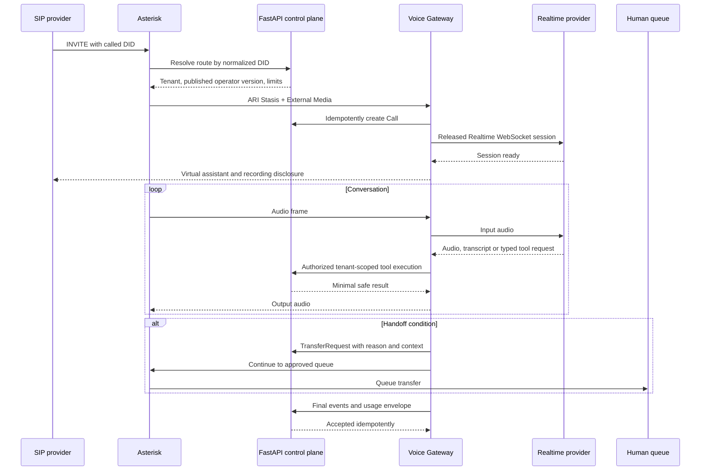

# Call flow

The greeting must identify a virtual assistant and state that the conversation may be recorded. Recording can be disabled by tenant policy and paused around sensitive data.

Handoff is requested on explicit human request, repeated misunderstanding, knowledge gap, prohibited operation, critical tool error, serious complaint, duration limit, or confidence below policy. The operator context contains customer identity when authorized, language, reason, partial summary, transcript, safe tool history and CRM reference. If no operator is available, the configured flow offers a callback, reports business hours and ends cleanly.

The development simulator exercises persistence and policy using text. It does not exercise SIP, RTP, audio codecs, STT, TTS or a Realtime model.
