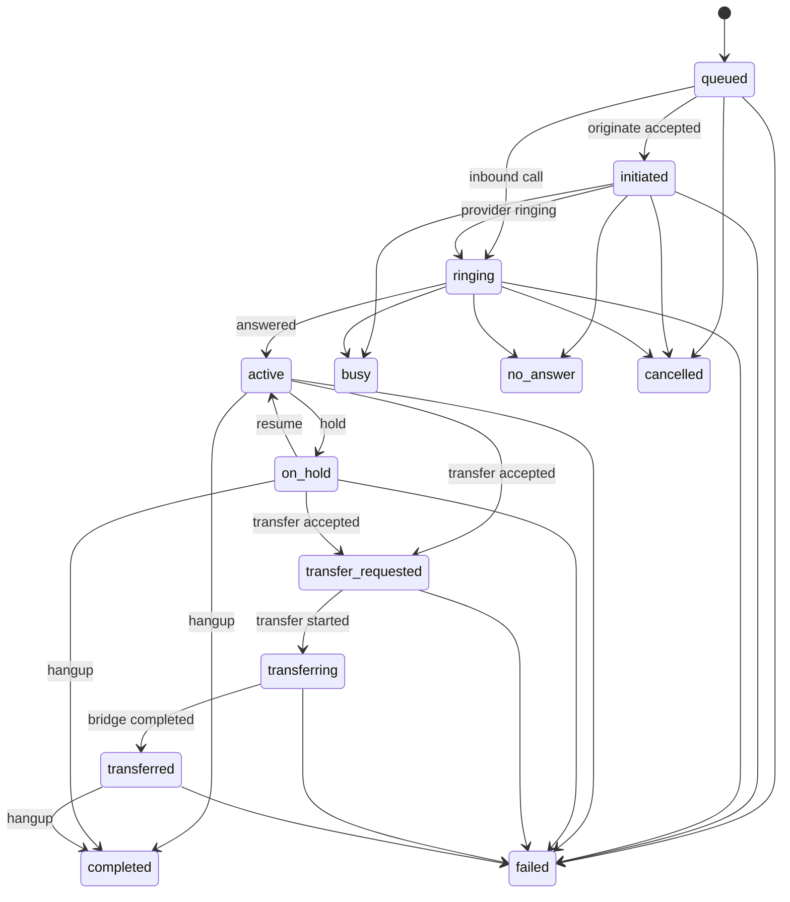

# K-Line Call state machine

## Назначение и граница ответственности

`Call.status` в FastAPI — каноническое состояние звонка. Только
`CallStateService` (`services/api/teamora_api/call_state.py`) может менять это
поле. API routers, Mock-провайдер, simulator и provider webhooks передают
команды или события в domain service и не присваивают статус напрямую.

## Состояния и действия

| Состояние            | Значение                                   | Допустимые команды оператора        |
| -------------------- | ------------------------------------------ | ----------------------------------- |
| `queued`             | Звонок создан, команда ещё не подтверждена | cancel                              |
| `initiated`          | Провайдер принял originate                 | hangup/cancel                       |
| `ringing`            | Идёт вызов                                 | answer, hangup/cancel               |
| `active`             | Разговор после ответа                      | hold, transfer, hangup, recording   |
| `on_hold`            | Клиент на удержании                        | resume, transfer, hangup, recording |
| `transfer_requested` | Провайдер принял запрос перевода           | hangup                              |
| `transferring`       | Формируется bridge/канал перевода          | hangup                              |
| `transferred`        | Клиент передан другому участнику           | hold, hangup, recording             |
| `completed`          | Нормально завершён                         | нет                                 |
| `busy`               | Линия занята                               | нет                                 |
| `no_answer`          | Нет ответа                                 | нет                                 |
| `failed`             | Ошибка провайдера/сети                     | нет                                 |
| `cancelled`          | Отменён до ответа                          | нет                                 |

Все переходы перечислены в `ALLOWED_TRANSITIONS`. Переход в то же состояние
идемпотентен и не увеличивает `state_version`; любой другой неописанный переход
возвращает `409 call_state_transition_invalid`.

Терминальные состояния: `completed`, `busy`, `no_answer`, `failed`,
`cancelled`. Они не занимают tenant/project/operator call capacity и не могут
вернуться в нетерминальное состояние.

## Timestamps и optimistic concurrency

- `started_at` устанавливается при `initiated` или первом `ringing`;
- `ringing_at` — при первом `ringing`;
- `answered_at` — один раз при первом `active`;
- `held_at` отражает текущее удержание; полная история удержаний находится в
  `call_events`;
- `ended_at` и `hangup_cause` устанавливаются только при терминальном переходе;
- `state_version` увеличивается на каждом реальном переходе.

Командные endpoints принимают `X-Call-State-Version`. Несовпадение версии
возвращает `409 call_state_version_conflict`. Dialer не заменяет более новую
версию звонка устаревшим polling-ответом. Таймер считается от `answered_at` и
фиксируется по `ended_at`.

## Нормализованные provider events

Поддерживаются `call.initiated`, `call.ringing`, `call.answered`, `call.held`,
`call.resumed`, `transfer.requested`, `transfer.started`,
`transfer.completed`, `call.busy`, `call.no_answer`, `call.failed`,
`call.hangup`, `call.cancelled` и совместимые `telephony.*` события.

- `(tenant_id, provider, provider_event_id)` уникален;
- повтор в одной или разных транзакциях не создаёт второй `CallEvent`;
- scope события проверяется по уже сохранённым `Call` и успешной исходящей
  команде, а не доверенному payload;
- событие старше `last_provider_event_at` сохраняется как
  `provider.event_ignored` с причиной `out_of_order`;
- неизвестное событие безопасно сохраняется с причиной `unknown_event`;
- несовместимое событие сохраняется с причиной `transition_conflict` и audit,
  но не откатывает состояние.

В `provider_metadata` допускаются только безопасные диагностические поля.
Credentials, токены и полная provider-конфигурация не сохраняются.

## Hangup causes

Канонические причины: `normal`, `caller_hangup`, `operator_hangup`, `busy`,
`no_answer`, `rejected`, `network_error`, `provider_error`, `timeout`,
`cancelled`, `unknown`. Безопасная исходная причина провайдера может храниться
в `raw_provider_cause` (до 160 символов).

## Reconciliation

`POST /api/v1/calls/{call_id}/reconcile` через
`CallReconciliationService` запрашивает `get_call_state` у выбранного
TelephonyProvider, сравнивает его с FastAPI source of truth и применяет только
допустимый переход. Результат `already_consistent`, `terminal`,
`unknown_provider_state` или `transition_conflict` не меняет Call и фиксируется
в событиях/audit. Недоступность Gateway возвращается как стабильная
provider-ошибка.

## Миграция legacy

Revision `k03c8h4f2d96` сохраняет существующие calls, events, outcomes, tasks и
`call_flow_version_id`. Legacy состояния `queued`, `ringing`, `active`,
`transferring`, `completed`, `failed` уже являются каноническими. Неизвестное
значение безопасно переводится в `failed`. Downgrade сопоставляет:

- `initiated` → `queued`;
- `on_hold`, `transfer_requested`, `transferred` → `active`;
- `busy`, `no_answer`, `cancelled` → `failed`.

Проверка сохранности запускается командой
`.venv\\Scripts\\python.exe scripts/run_call_state_migration_test.py` и всегда
использует отдельную локальную БД с удалением в `finally`.

## Live verification

Mock flow полностью проверяем локально. Реальный Asterisk/SIP остаётся
`IMPLEMENTED — LIVE ASTERISK VERIFICATION REQUIRED`: без trunk/DID и тестового
аудиовызова нельзя подтвердить provider timing, raw causes, bridge transfer и
reconciliation реального канала. OpenAI Realtime на этом этапе не вызывается.
