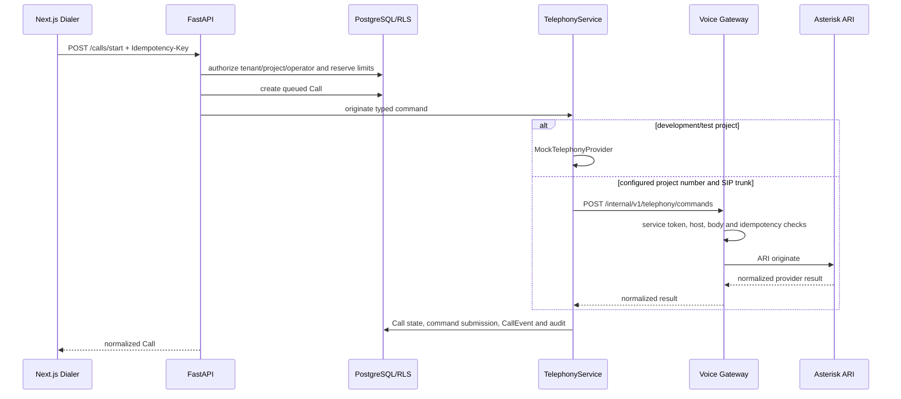

# Unified telephony layer

## Status

- Mock provider: implemented and covered by deterministic tests.
- FastAPI control plane: implemented for outbound Mock calls and Gateway command dispatch.
- Gateway internal API: implemented with service authentication and bounded requests.
- Asterisk ARI adapter: `IMPLEMENTED — LIVE ASTERISK VERIFICATION REQUIRED`.
- Carrier SIP, RTP media and real audio: not verified and not claimed as working.
- OpenAI Realtime: outside Stage 7 and not invoked by this layer.

## Ownership boundary

| Component            | Responsibility                                                                                                |
| -------------------- | ------------------------------------------------------------------------------------------------------------- |
| Next.js              | Calls the public FastAPI API and renders normalized state. It never receives provider credentials.            |
| FastAPI              | Authorizes tenant/project/operator, enforces limits, owns `Call`, command idempotency, `CallEvent` and audit. |
| `TelephonyService`   | Selects the project provider and converts stable business commands to the shared telephony contract.          |
| Mock provider        | Executes deterministic development/test commands without a network or real phone number.                      |
| Voice Gateway        | Authenticates internal commands and owns provider-specific realtime/Asterisk behavior.                        |
| Asterisk ARI adapter | Maps the shared contract to ARI HTTP endpoints. It does not own CRM state.                                    |

Provider-specific behavior is prohibited in FastAPI routers. The source of truth remains PostgreSQL behind tenant RLS.

## Outbound command sequence

## Provider event sequence

When the later ARI listener is wired, it must follow this prepared ingestion sequence:

1. Gateway formats an event using the versioned `TelephonyProviderEvent` contract.
2. Gateway signs the raw body with `GATEWAY_SERVICE_TOKEN` and sends it to `/api/v1/webhooks/telephony`.
3. FastAPI verifies signature and timestamp before parsing the event.
4. FastAPI sets RLS context from the signed tenant ID, then verifies stored Call, project, provider and external call ID.
5. Outbound events must match a successful stored command.
6. `(tenant_id, provider, provider_event_id)` is unique; replay does not create a second `CallEvent`.
7. Only allowlisted safe payload fields are persisted. Credentials, audio and full provider payloads are not logged.

The ARI WebSocket event listener is not connected in Stage 7. The ingestion contract is ready for later work.

## Provider selection

1. An active project outbound `PhoneNumber` linked to a configured or verified tenant `SipTrunk` selects `asterisk-ari` through Gateway.
2. Development and test projects without real telephony select Mock.
3. Staging/production projects without configured telephony receive `telephony_not_configured`.
4. Production Mock is disabled by default. It requires the explicit `ALLOW_MOCK_TELEPHONY_IN_PRODUCTION=true` override and must not be enabled for a real deployment.
5. Provider selection is project-aware; a global environment flag alone cannot select Asterisk.

## Public call API

- `POST /api/v1/calls/start`
- `POST /api/v1/calls/{id}/answer`
- `POST /api/v1/calls/{id}/hangup`
- `POST /api/v1/calls/{id}/hold`
- `POST /api/v1/calls/{id}/resume`
- `POST /api/v1/calls/{id}/transfer`
- `GET /api/v1/calls/{id}/state`
- `POST /api/v1/calls/{id}/reconcile`
- `GET /api/v1/calls/active`

Mutating commands accept `Idempotency-Key`. Existing clients without the header remain compatible through a deterministic per-call command key.

## Internal Gateway API

`POST /internal/v1/telephony/commands` is for FastAPI only. Controls:

- Bearer service authentication;
- trusted Host allowlist;
- JSON content-type and bounded body size;
- correlation ID and bounded provider timeout;
- process-local replay cache plus durable FastAPI command idempotency;
- structured redacted logs.

Required variable names, without values:

- `GATEWAY_INTERNAL_URL`
- `GATEWAY_SERVICE_TOKEN`
- `GATEWAY_COMMAND_TIMEOUT_SECONDS`
- `GATEWAY_TRUSTED_HOSTS`
- `GATEWAY_MAX_BODY_BYTES`
- `GATEWAY_PORT`
- `ASTERISK_ARI_URL`
- `ASTERISK_ARI_USERNAME`
- `ASTERISK_ARI_PASSWORD`
- `ASTERISK_ARI_TIMEOUT_MS`
- `ASTERISK_EXTERNAL_MEDIA_HOST`
- `ASTERISK_EXTERNAL_MEDIA_TRANSPORT`
- `ALLOW_MOCK_TELEPHONY_IN_PRODUCTION`

## Mock development flow

1. Assign a customer through `/app/dialer`.
2. Start a call; Mock returns `ringing` without network access.
3. Simulate answer, hold, resume and transfer.
4. Hang up and save the project result/task/callback.
5. Inspect normalized events and audit records.

Mock also supports deterministic busy, no-answer, failed and recording actions at provider-contract level.

Canonical transitions, terminal capacity rules, optimistic concurrency and
out-of-order provider event handling are documented in
[call-state-machine.md](call-state-machine.md).

## Live verification checklist

Do not mark Asterisk/SIP as working until a controlled non-production test verifies:

- service-to-service path on the private network;
- ARI authentication and Stasis application;
- originate, answer, hold/resume, transfer and hangup;
- inbound and outbound carrier calls;
- concurrent channel limits;
- PJSIP/NAT/RTP and audio in both directions;
- recording start/pause/resume/stop and consent policy;
- ARI event WebSocket reconnect and provider-event delivery;
- CDR reconciliation and clean failure behavior.

Stage 7 performs no real SIP, Asterisk or OpenAI request.
